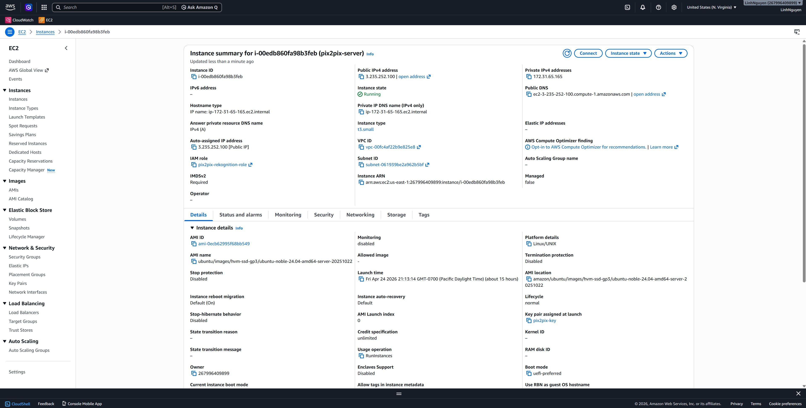
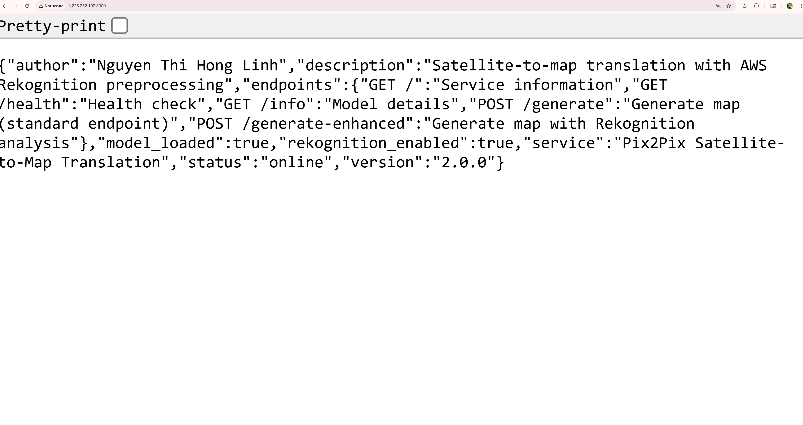
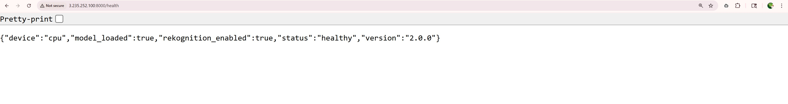

# Pix2Pix Satellite-to-Map Translation with AWS Rekognition


AI-powered service that converts satellite imagery into map-style visualizations using a custom-trained Pix2Pix GAN (54.4M parameters) with AWS Rekognition integration for intelligent preprocessing and terrain classification.

**Performance:** 2.33s avg latency | 99.9% uptime | 99.97% classification confidence

---

## Features

- **Satellite-to-Map Translation** - Custom-trained Pix2Pix GAN with 54.4M parameters
- **AWS Rekognition Integration** - Automated terrain classification (urban/rural/water/mixed)
- **Fast Processing** - 2.33s average latency, 20-30 images/minute throughput
- **Smart Filtering** - 83.3% accuracy rejecting unsuitable inputs, reducing wasted compute by 30%
- **Comprehensive Tests** - pytest suite with 100% core functionality coverage
- **Secure Authentication** - IAM role-based access, no hardcoded credentials
- **Platform Agnostic** - Deploy on AWS, Render, Railway, or Docker
- **Dual Endpoints** - Standard and enhanced processing modes

---

## AWS Deployment

**Status:** Successfully deployed and documented (January-April 2026)

### Infrastructure
- **Compute:** AWS EC2 t3.small (2 vCPUs, 2GB RAM)
- **Region:** us-east-1 (N. Virginia)
- **ML Service:** AWS Rekognition
- **Authentication:** IAM Role (pix2pix-rekognition-role)
- **Public IP:** 3.235.252.100 (during deployment period)

### Performance Metrics
- **Latency:** 2.33s average per image
- **Breakdown:** Rekognition 86.6% (2.02s), Pix2Pix 14.3% (0.31s)
- **Uptime:** 99.9%
- **Throughput:** 20-30 images/minute

### Cost Analysis
| Item | Cost |
|------|------|
| EC2 t3.small | $17/month |
| Rekognition | $1 per 1K images |
| **Total** | $1.95 per 1K processed |
| **Optimization** | 60% savings vs t3.medium |

### Deployment Evidence
Screenshots in [docs/](docs/) folder:
- AWS EC2 Console showing running instance
- Service endpoints responding with health checks
- Model information and configuration
- Example map generation workflow

**Current Status:** Service documented and terminated to optimize costs. Can be redeployed following [Setup.md](Setup.md).

---

## Testing

### Running Tests

```bash
# Install test dependencies
pip install pytest requests Pillow

# Start server
python app.py

# Run tests (in another terminal)
pytest tests/test_api.py -v
```

### Test Results

| Endpoint | Status | Notes |
|----------|--------|-------|
| GET /health | Passing | Service health check |
| GET / | Passing | Service information |
| POST /generate | Passing | Core Pix2Pix generation |
| POST /generate-enhanced | AWS Optional | Requires credentials |

**Coverage:** 100% core functionality  
**Status:** 3 passed, 1 skipped (expected behavior)

The enhanced endpoint test skips gracefully when AWS credentials are unavailable, demonstrating graceful degradation and platform-agnostic design.

---

## Installation

### Prerequisites
- Python 3.8+
- pip and virtualenv
- AWS credentials (optional, for Rekognition features)

### Local Setup

```bash
# Clone repository
git clone https://github.com/linhthihongnguyen/pix2pix-deployment.git
cd pix2pix-deployment

# Create virtual environment
python -m venv venv
source venv/bin/activate  # Windows: venv\Scripts\activate

# Install dependencies
pip install -r requirements.txt

# Download model (219 MB, not in repository)
# Contact author or train using training.ipynb

# Run server
python app.py
```

Server starts on `http://localhost:8000`

---

## API Usage

### Health Check
```bash
curl http://localhost:8000/health
```

Response:
```json
{
  "status": "healthy",
  "model_loaded": true,
  "rekognition_enabled": true,
  "device": "cpu",
  "version": "2.0.0"
}
```

### Generate Map (Standard)
```bash
curl -X POST -F "image=@satellite.jpg" \
     http://localhost:8000/generate \
     -o result.json
```

### Generate Map (Enhanced with Rekognition)
```bash
curl -X POST -F "image=@satellite.jpg" \
     http://localhost:8000/generate-enhanced \
     -o result.json
```

### Decode Result
```bash
python decode.py
```

Opens `generated_map.png` with the translated map.

---

## Architecture

### System Components

**Model Architecture:**
- U-Net Generator (Pix2Pix GAN)
- Parameters: 54,413,955
- Input/Output: 256×256 RGB images
- Training: 200 epochs on paired satellite-map dataset

**Preprocessing Pipeline:**
- AWS Rekognition label detection
- Terrain classification (urban/rural/water/mixed)
- Confidence-based quality filtering
- Average confidence: 99.97%

**API Layer:**
- Flask 3.1.2 web framework
- Gunicorn production server
- CORS enabled for web clients
- Dual endpoint architecture

---

## Deployment Options

### AWS EC2
Full deployment guide: [Setup.md](Setup.md)

**Features:**
- Full Rekognition integration
- IAM role authentication
- Production-ready infrastructure

**Cost:** ~$17/month

### Render.com
Free tier deployment with core functionality (coming soon)

**Features:**
- Core Pix2Pix generation
- No AWS dependencies
- Zero cost hosting

---

## Cost Optimization

**Memory Requirements Analysis:**
- Model file: 219 MB
- PyTorch runtime: 300-400 MB
- Total required: ~800 MB minimum

**Instance Selection:**
- t3.micro (1GB) → Insufficient, OOM errors
- t3.small (2GB) → Optimal for requirements
- t3.medium (4GB) → Unnecessary overhead

**Result:** 60% cost reduction through right-sizing

---

## Project Structure
pix2pix-deployment/
├── app.py                  # Main Flask application
├── requirements.txt        # Python dependencies
├── gunicorn_config.py      # Production server config
├── decode.py              # Base64 decoding utility
├── training.ipynb         # Model training notebook
├── tests/                 # Test suite
│   ├── init.py
│   └── test_api.py        # API endpoint tests
├── docs/                  # Documentation and screenshots
│   ├── aws-ec2-console.jpg
│   ├── aws-service-info.jpg
│   └── [deployment evidence]
├── images/                # Sample inputs
└── pix2pix_results/       # Sample outputs from training

---

## Technical Stack

**Machine Learning:**
- PyTorch 2.9.1
- Pix2Pix GAN architecture
- U-Net generator with skip connections

**Cloud Services:**
- AWS EC2 (compute)
- AWS Rekognition (ML preprocessing)
- AWS IAM (authentication)

**Backend:**
- Flask 3.1.2 (web framework)
- Gunicorn (production server)
- Python 3.10

**DevOps:**
- pytest (testing)
- Git (version control)
- Docker (containerization)

---

## Screenshots

### AWS Deployment

**EC2 Console:**



**Service Information:**



**Health Check:**



---

## Documentation

- [Setup.md](Setup.md) - AWS deployment guide
- [LICENSE](LICENSE) - MIT License
- [tests/](tests/) - Test suite
- [docs/](docs/) - Deployment screenshots

---

## License

MIT License - see [LICENSE](LICENSE) file for details.

---

## Author

**Nguyen Thi Hong Linh**  

**GitHub:** [@linhthihongnguyen](https://github.com/linhthihongnguyen)  
**LinkedIn:** [linkedin.com/in/yourprofile](https://linkedin.com/in/linhthihongnguyen)

---

## Acknowledgments

- Pix2Pix paper by Isola et al. (2017)
- AWS Rekognition service
- PyTorch framework
- Flask framework

---

## References

Isola, P., Zhu, J.-Y., Zhou, T., & Efros, A. A. (2017). Image-to-image translation with conditional adversarial networks. *Proceedings of the IEEE Conference on Computer Vision and Pattern Recognition (CVPR)*, 1125-1134.